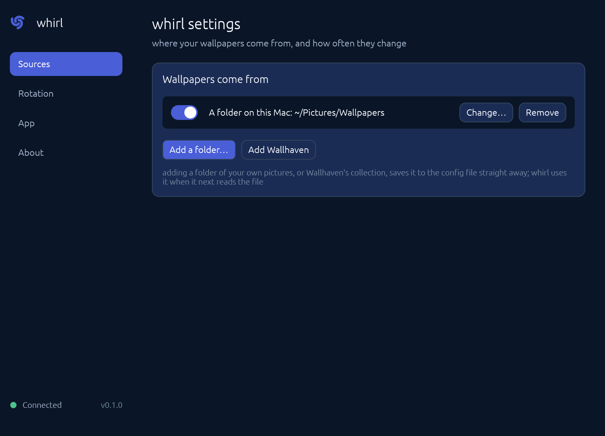

# Whirl

Wallpaper that rotates on a schedule, from folders you choose, from the menu bar.

Whirl puts the [whirl](https://github.com/guruor/whirl) wallpaper daemon on the menu bar. The daemon is
headless: it owns the wallpaper, the rotation, the sources and every piece of state, and this app is an
ordinary client of it, which owns none of that. The app writes no state file, calls no platform setter,
and holds no copy of the configuration it did not read back through the protocol. Its one part in the
daemon's lifecycle is the daemon's own command: when the daemon is not answering the app offers a
`Start whirl` control, and pressing it runs `whirl daemon start`, which asks the OS supervisor for the
job the supervisor already owns. The app never writes a unit file, never unlinks a socket and never
kills a process. Its whole obligation to the daemon is whirl's
[`docs/architecture.md` section
8](https://github.com/guruor/whirl/blob/main/docs/architecture.md#8-frontend-contract), "Frontend
contract", which lists what a frontend may rely on and what it must never do.

## Install

One command installs the daemon and the app, and reuses a daemon that is already there. It downloads
two archives, checks each against the sha256 published beside it, and writes nothing until both checks
pass. It uses no root and asks no question. Read it first:

    curl -fsSLO https://raw.githubusercontent.com/guruor/whirl-ui/v0.2.2/install.sh
    less install.sh
    sh install.sh

The same thing as one line, for anyone who has read it and trusts it:

    curl -fsSL https://raw.githubusercontent.com/guruor/whirl-ui/v0.2.2/install.sh | sh

The daemon goes into `~/.local/bin` and `Whirl.app` into `/Applications`, which is outside your home:
that one write is the only step macOS may ask you to authorize, and the script prints what may be asked
and why rather than driving or dismissing that dialog. Whirl is not notarized, so its first launch may
report that macOS cannot check it: open it once from Applications and allow it under
System Settings > Privacy & Security if asked.

What was installed is recorded in a receipt (`WHIRL_UI_RECEIPT`, by default
`~/Library/Application Support/whirl-ui/install.receipt`), and `uninstall.sh` removes the paths in that
receipt and nothing else; the script prints that one undo command when it finishes. A daemon or app
that was already here was reused, not installed, and both scripts leave it alone: `uninstall.sh` never
kills a process it did not start, and it names what it deliberately leaves alone, the daemon's config,
state, cache and log. The daemon's own login unit is whirl's to install and whirl's to remove, so
neither script writes a unit file. [`docs/installation.md`](docs/installation.md) is the long version:
both routes step by step, and the paths either one touches.

## Features

- Rotation on a schedule. The interval is the daemon's; the app shows the one in use.
- Sources from your own folders, and Wallhaven's collection, each switched on or off without leaving
  the config file.
- Three menu bar states: running, paused, and the daemon unreachable, where the item says so and the
  rows that need the daemon are disabled.
- Start at login, through the app's own login item.
- No account, and no telemetry.
- The app is optional: whirl runs and rotates the wallpaper without it, and keeps rotating if the app
  is quit.

## How it fits together

The daemon and the app are two programs and one socket. The daemon listens, owns the state and does the
rotating; the app connects to the socket, reads `status`, follows `subscribe` for change notification
and sends the daemon's own verbs back to it. The app is an ordinary client with no privileged access
and no side channel, and whirl's
[`docs/architecture.md` section
8](https://github.com/guruor/whirl/blob/main/docs/architecture.md#8-frontend-contract) is the contract
it is written to.

## Docs

- [`docs/installation.md`](docs/installation.md): both install routes, step by step.
- [`docs/design.md`](docs/design.md): the visual language, and what each element the design draws would
  cost in config.
- [`docs/releases/v0.2.2.md`](docs/releases/v0.2.2.md): what this build is, what its first launch needs,
  and what it does not do.
- [whirl's docs](https://github.com/guruor/whirl/tree/main/docs): the daemon's own side of the socket,
  its architecture and its protocol.

## Contributing

Development material lives in [`CONTRIBUTING.md`](CONTRIBUTING.md): the toolchain, the checks a pull
request must pass, the verify verbs and the release path.

## Licence

MIT. See [LICENSE](LICENSE).
